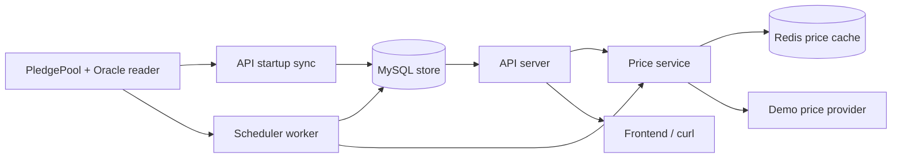

# pledgev2 rebackend

This is a clean Go backend rebuild of the original `pledge-backend` with codex asistant. It is intended to test AI's capabilities and explore best practices for AI-assisted development.

- API server: serve frontend/admin HTTP APIs, token list, pool data, login, websocket price push.

- Scheduler worker: read on-chain pool/oracle data and save snapshots into data store.



## API Endpoints

Health:

```text
GET  /healthz
```

Public read APIs:

```text
GET  /api/v1/poolBaseInfo?chainId=97
GET  /api/v1/poolDataInfo?chainId=97
GET  /api/v1/token?chainId=97
GET  /api/v1/price?symbol=PLGR
```

Auth APIs:

```text
POST /api/v1/user/login
POST /api/v1/user/logout
```

Protected admin APIs:

```text
GET  /api/v1/admin/session
POST /api/v1/pool/setMultiSign
POST /api/v1/pool/getMultiSign
```

Protected routes require either header:

```text
Authorization: Bearer <tokenId>
```

or:

```text
authCode: <tokenId>
```

The `/api/v1` prefix uses `PLEDGE_API_VERSION=1`.

## Docker Compose

Run the rebuild stack with API, scheduler, MySQL, and Redis:

```bash
cd pledgev2-rebackend
docker compose up --build
```

The API is exposed on your host at `http://localhost:8081`.

Quick checks:

```bash
curl http://localhost:8081/healthz
curl "http://localhost:8081/api/v1/poolBaseInfo?chainId=97"
curl "http://localhost:8081/api/v1/price?symbol=PLGR"
```

Stop the stack:

```bash
docker compose down
```

Remove the MySQL volume too:

```bash
docker compose down -v
```

- `Dockerfile` describes how to build your Go app image from source code.
  Docker Compose needs instructions for turning api and scheduler repo into runnable binaries:
  ```
  RUN go build -o /out/api ./cmd/api
  RUN go build -o /out/scheduler ./cmd/scheduler
  ```

- `docker-compose.yml` describes which containers to run together.
  ```
  run api
  run scheduler
  run mysql
  run redis
  connect them with env vars
  expose API on localhost:8081
  ```

## Cache

The rebuild uses Redis for runtime caching. Currently Redis caches price quotes
such as `price:PLGR`.

Redis config:

```text
PLEDGE_REDIS_ADDR=127.0.0.1:6379
PLEDGE_REDIS_PASSWORD=
PLEDGE_REDIS_DB=0
PLEDGE_PRICE_CACHE_TTL=30s
```

Run API with Redis cache:

```bash
cd pledgev2-rebackend
PLEDGE_REDIS_ADDR=127.0.0.1:6379 \
PLEDGE_PRICE_CACHE_TTL=30s \
PLEDGE_API_PORT=8081 \
go run ./cmd/api
```

Run scheduler with Redis cache:

```bash
cd pledgev2-rebackend
PLEDGE_REDIS_ADDR=127.0.0.1:6379 \
PLEDGE_PRICE_CACHE_TTL=30s \
PLEDGE_SYNC_INTERVAL=30s \
go run ./cmd/scheduler
```

Important:

```text
Redis must be running before starting the API or scheduler.
```

## Storage

The rebuild supports two storage modes:

```text
PLEDGE_STORE=memory
```

Use in-memory storage for learning, tests, and quick local API runs. API and
scheduler processes do not share memory with each other.

```text
PLEDGE_STORE=mysql
```

Use MySQL when you want API and scheduler processes to share the same indexed
state, like the original backend.

Example MySQL DSN:

```text
PLEDGE_MYSQL_DSN="pledge:pledge@tcp(127.0.0.1:3306)/pledge_rebackend?parseTime=true&charset=utf8mb4&loc=Local"
```

The MySQL store creates these tables if they do not exist:

- `poolbases`
- `pooldata`
- `token_info`
- `multi_sign`

Run API with MySQL:

```bash
cd pledgev2-rebackend
PLEDGE_STORE=mysql \
PLEDGE_MYSQL_DSN="pledge:pledge@tcp(127.0.0.1:3306)/pledge_rebackend?parseTime=true&charset=utf8mb4&loc=Local" \
PLEDGE_ENV=local \
PLEDGE_CHAIN_ID=97 \
PLEDGE_API_VERSION=1 \
PLEDGE_API_PORT=8081 \
go run ./cmd/api
```

Run scheduler with MySQL:

```bash
cd pledgev2-rebackend
PLEDGE_STORE=mysql \
PLEDGE_MYSQL_DSN="pledge:pledge@tcp(127.0.0.1:3306)/pledge_rebackend?parseTime=true&charset=utf8mb4&loc=Local" \
PLEDGE_ENV=local \
PLEDGE_CHAIN_ID=97 \
PLEDGE_SYNC_INTERVAL=30s \
go run ./cmd/scheduler
```

Important:

```text
Use parseTime=true in the DSN so MySQL DATETIME columns scan into Go time.Time.
```

## Step 1: Runnable API Skeleton

Files:

- `cmd/api/main.go`
- `internal/config/config.go`
- `internal/httpserver/server.go`
- `internal/logging/logger.go`

Run:

```bash
cd pledgev2-rebackend
PLEDGE_ENV=local PLEDGE_API_PORT=8081 go run ./cmd/api
```

Then open:

```text
GET http://localhost:8081/healthz
```

Run Go Tests:

```bash
cd pledgev2-rebackend
# Run all Go tests in the current module, recursively.
go test ./...
```

Learning goal:

- Build the smallest runnable backend API process.
- Keep configuration loading separate from HTTP route setup.
- Create a health endpoint before adding database, Redis, or contract logic.
- Establish the future runtime path: `main -> config -> logger -> HTTP server`.

In interview, say:

```text
I started the backend rebuild with a small runnable API skeleton. The first
checkpoint proves the process can load config, start an HTTP server, and expose
a health check before adding storage or chain indexing.
```
## Step 2: Database models

Files:

- `internal/store/models.go`
- `internal/store/repository.go`
- `internal/store/memory.go`
- `internal/store/memory_test.go`

Run:

```bash
cd pledgev2-rebackend
go test ./...
```

Learning goal:

- Model the three core backend tables from the original project:
  `poolbases`, `pooldata`, and `token_info`.
- Keep chain values and token amounts as strings because contract values are
  large integer strings, not floats.
- Use `chainID + poolID` as the logical pool key.
- Use `chainID + token address` as the logical token key.
- Add a repository interface before adding MySQL so the API can depend on
  behavior instead of a concrete database driver.

For now, Step 2 uses an in-memory repository. MySQL comes later after the API
shape is clear.

In interview, say:

```text
I modeled the backend data around the same source-of-truth snapshots as the
original service: pool base config, pool settlement data, and token metadata.
The repository interface lets the API read pool data without caring whether the
storage is memory, MySQL, or a test double.
```

## Step 3: Read-only API

Files:

- `internal/httpserver/server.go`
- `internal/httpserver/server_test.go`
- `internal/chain/demo_reader.go`
- `internal/config/config.go`
- `cmd/api/main.go`

Run:

```bash
cd pledgev2-rebackend
PLEDGE_ENV=local PLEDGE_API_VERSION=1 PLEDGE_API_PORT=8081 go run ./cmd/api
```

Then query:

```bash
curl "http://localhost:8081/api/v1/poolBaseInfo?chainId=97"
curl "http://localhost:8081/api/v1/poolDataInfo?chainId=97"
curl "http://localhost:8081/api/v1/token?chainId=97"
```

Run Go Tests:

```bash
cd pledgev2-rebackend
go test ./...
```

Learning goal:

- Expose the first read-only API routes from the original backend.
- Keep route handlers thin: parse `chainId`, call the repository, return JSON.
- Serve data from the repository interface instead of hardcoding storage details
  into the HTTP layer.
- Use seeded memory data until the contract reader and MySQL store are added.

In interview, say:

```text
I added the read API as a thin layer over the repository. The handlers validate
request parameters, read pool/token snapshots from storage, and return JSON.
Because the API depends on an interface, the same routes can later read from
MySQL without changing handler behavior.
```

## Step 4: Contract reader

Files:

- `internal/chain/reader.go`
- `internal/chain/demo_reader.go`
- `internal/chain/sync.go`
- `internal/chain/sync_test.go`
- `cmd/api/main.go`
- `internal/config/config.go`

Run:

```bash
cd pledgev2-rebackend
PLEDGE_ENV=local PLEDGE_CHAIN_ID=97 PLEDGE_API_VERSION=1 PLEDGE_API_PORT=8081 go run ./cmd/api
```

Then query:

```bash
curl "http://localhost:8081/api/v1/poolBaseInfo?chainId=97"
curl "http://localhost:8081/api/v1/poolDataInfo?chainId=97"
curl "http://localhost:8081/api/v1/token?chainId=97"
```

Run Go Tests:

```bash
cd pledgev2-rebackend
go test ./...
```

Learning goal:

- Define the boundary between backend code and on-chain contract reads.
- Keep raw contract-shaped data separate from database/API models.
- Translate contract indexes into API pool IDs: contract index `0` becomes
  `poolID = 1`.
- Sync pool base data, pool settlement data, and token metadata into the
  repository through one function.

For now, Step 4 uses `DemoReader` instead of a real RPC client. The next real
reader can implement the same `chain.Reader` interface.

In interview, say:

```text
I separated contract reading from storage. The reader returns raw PledgePool
snapshots, and the sync function maps those snapshots into repository models.
That keeps RPC/ABI details out of the HTTP layer and gives the scheduler one
clear job: read contract state and persist the indexed snapshot.
```

## Step 5: Scheduler

Files:

- `cmd/scheduler/main.go`
- `internal/scheduler/pool_syncer.go`
- `internal/scheduler/pool_syncer_test.go`
- `internal/config/config.go`

Run:

```bash
cd pledgev2-rebackend
PLEDGE_ENV=local PLEDGE_CHAIN_ID=97 PLEDGE_SYNC_INTERVAL=30s go run ./cmd/scheduler
```

Run Go Tests:

```bash
cd pledgev2-rebackend
go test ./...
```

Learning goal:

- Build the second backend process: a scheduler worker.
- Reuse the same `chain.SyncPools` function from the API bootstrap path.
- Run one sync immediately, then repeat on `PLEDGE_SYNC_INTERVAL`.
- Keep failures isolated to one sync attempt so the worker can keep running.

Important for this checkpoint:

```text
The scheduler currently writes to an in-memory repository. That means the API
and scheduler do not share data when they run as separate processes yet. In the
original backend, MySQL is the shared source that connects them. We add that
later.
```

In interview, say:

```text
I split the background indexing work into a scheduler process. It runs the same
contract-reader sync path on an interval, so the scheduler's job is simple:
read contract snapshots, map them into backend models, and persist them through
the repository.
```

## Step 6: Admin auth

Files:

- `internal/auth/service.go`
- `internal/auth/service_test.go`
- `internal/httpserver/server.go`
- `internal/httpserver/server_test.go`
- `internal/config/config.go`
- `cmd/api/main.go`

Run:

```bash
cd pledgev2-rebackend
PLEDGE_ENV=local \
PLEDGE_CHAIN_ID=97 \
PLEDGE_API_VERSION=1 \
PLEDGE_API_PORT=8081 \
PLEDGE_ADMIN_USERNAME=admin \
PLEDGE_ADMIN_PASSWORD=password \
PLEDGE_TOKEN_SECRET=local-secret \
PLEDGE_TOKEN_TTL=1h \
go run ./cmd/api
```

Login:

```bash
curl -X POST "http://localhost:8081/api/v1/user/login" \
  -H "Content-Type: application/json" \
  -d '{"name":"admin","password":"password"}'
```

Use the returned `tokenId`:

```bash
curl "http://localhost:8081/api/v1/admin/session" \
  -H "Authorization: Bearer <tokenId>"
```

Logout:

```bash
curl -X POST "http://localhost:8081/api/v1/user/logout" \
  -H "Authorization: Bearer <tokenId>"
```

Run Go Tests:

```bash
cd pledgev2-rebackend
go test ./...
```

Learning goal:

- Add config-driven admin credentials.
- Issue signed tokens after login.
- Track active sessions in memory so logout can revoke a token.
- Protect admin routes with auth middleware.
- Keep compatibility with the original backend's `authCode` header while also
  supporting the common `Authorization: Bearer ...` header.

Important for this checkpoint:

```text
Sessions are still in memory. In the original backend, Redis stores login state
so logout survives across API processes. We will keep that idea in mind when
real storage/cache integration is added.
```

In interview, say:

```text
I added admin auth as a small middleware layer. Login checks configured admin
credentials, returns a signed token, and stores an active session. Protected
routes verify the token signature and session state, and logout removes the
session so the same token can no longer be used.
```

## Step 7: Price service

Files:

- `internal/price/service.go`
- `internal/price/demo_provider.go`
- `internal/price/service_test.go`
- `internal/httpserver/server.go`
- `internal/httpserver/server_test.go`
- `internal/scheduler/pool_syncer.go`
- `internal/config/config.go`
- `cmd/api/main.go`
- `cmd/scheduler/main.go`

Run API:

```bash
cd pledgev2-rebackend
PLEDGE_ENV=local \
PLEDGE_CHAIN_ID=97 \
PLEDGE_API_VERSION=1 \
PLEDGE_API_PORT=8081 \
PLEDGE_PRICE_SYMBOL=PLGR \
go run ./cmd/api
```

Query latest price:

```bash
curl "http://localhost:8081/api/v1/price?symbol=PLGR"
```

Run scheduler:

```bash
cd pledgev2-rebackend
PLEDGE_ENV=local \
PLEDGE_CHAIN_ID=97 \
PLEDGE_SYNC_INTERVAL=30s \
PLEDGE_PRICE_SYMBOL=PLGR \
go run ./cmd/scheduler
```

Run Go Tests:

```bash
cd pledgev2-rebackend
go test ./...
```

Learning goal:

- Add a dedicated price service instead of mixing price logic into HTTP routes.
- Keep the price provider behind an interface so a future KuCoin or oracle
  provider can replace the demo provider.
- Expose `GET /api/v1/price?symbol=PLGR` for a simple latest-price read.
- Let the scheduler refresh/log the configured price symbol on each sync cycle.

Important for this checkpoint:

```text
The original backend streams PLGR-USDT through a websocket. This rebuild starts
with a normal JSON endpoint and a demo provider so the service boundary is
clear before adding websocket or external exchange dependencies.
```

In interview, say:

```text
I separated market price lookup into a price service. The API asks the service
for the latest quote, and the scheduler can refresh the same quote on its
interval. The provider is an interface, so the demo provider can later be
replaced by KuCoin, an oracle, or another price source.
```

## Step 8: Multisig/admin config API

Files:

- `internal/multisig/service.go`
- `internal/multisig/service_test.go`
- `internal/httpserver/server.go`
- `internal/httpserver/server_test.go`
- `cmd/api/main.go`

Run API:

```bash
cd pledgev2-rebackend
PLEDGE_ENV=local \
PLEDGE_CHAIN_ID=97 \
PLEDGE_API_VERSION=1 \
PLEDGE_API_PORT=8081 \
PLEDGE_ADMIN_USERNAME=admin \
PLEDGE_ADMIN_PASSWORD=password \
PLEDGE_TOKEN_SECRET=local-secret \
go run ./cmd/api
```

Login:

```bash
curl -X POST "http://localhost:8081/api/v1/user/login" \
  -H "Content-Type: application/json" \
  -d '{"name":"admin","password":"password"}'
```

Set multisig config:

```bash
curl -X POST "http://localhost:8081/api/v1/pool/setMultiSign" \
  -H "Authorization: Bearer <tokenId>" \
  -H "Content-Type: application/json" \
  -d '{
    "chain_id":"97",
    "sp_name":"SP",
    "_spToken":"SP",
    "jp_name":"JP",
    "_jpToken":"JP",
    "sp_address":"0xsp",
    "jp_address":"0xjp",
    "spHash":"0xsphash",
    "jpHash":"0xjphash",
    "multi_sign_account":["0xowner1","0xowner2"]
  }'
```

Get multisig config:

```bash
curl -X POST "http://localhost:8081/api/v1/pool/getMultiSign" \
  -H "Authorization: Bearer <tokenId>" \
  -H "Content-Type: application/json" \
  -d '{"chain_id":"97"}'
```

Run Go Tests:

```bash
cd pledgev2-rebackend
go test ./...
```

Learning goal:

- Add protected admin endpoints for chain-specific multisig metadata.
- Keep the original backend route names: `setMultiSign` and `getMultiSign`.
- Store one multisig config per chain ID.
- Require admin auth before reading or writing admin config.

Important for this checkpoint:

```text
The multisig config is still in memory. The original backend stores it in the
multi_sign MySQL table. This step focuses on the request shape, validation, auth
boundary, and service layer before adding persistent storage.
```

In interview, say:

```text
I added multisig admin config as a protected API. Admin users can set and fetch
the SP/JP multisig metadata for a chain, and the HTTP layer delegates validation
and storage to a service. In the production-style version, this service would
write to MySQL instead of memory.
```

## Step 9: Shared store and MySQL

Files:

- `internal/store/mysql.go`
- `internal/store/memory.go`
- `internal/store/memory_test.go`
- `internal/store/repository.go`
- `internal/multisig/service.go`
- `cmd/api/main.go`
- `cmd/scheduler/main.go`
- `internal/config/config.go`
- `go.mod`
- `go.sum`

Run with memory:

```bash
cd pledgev2-rebackend
PLEDGE_STORE=memory go test ./...
```

Run API with MySQL:

```bash
cd pledgev2-rebackend
PLEDGE_STORE=mysql \
PLEDGE_MYSQL_DSN="pledge:pledge@tcp(127.0.0.1:3306)/pledge_rebackend?parseTime=true&charset=utf8mb4&loc=Local" \
PLEDGE_CHAIN_ID=97 \
PLEDGE_API_VERSION=1 \
PLEDGE_API_PORT=8081 \
go run ./cmd/api
```

Run scheduler with MySQL:

```bash
cd pledgev2-rebackend
PLEDGE_STORE=mysql \
PLEDGE_MYSQL_DSN="pledge:pledge@tcp(127.0.0.1:3306)/pledge_rebackend?parseTime=true&charset=utf8mb4&loc=Local" \
PLEDGE_CHAIN_ID=97 \
PLEDGE_SYNC_INTERVAL=30s \
go run ./cmd/scheduler
```

Learning goal:

- Merge multisig persistence into the shared `store.Repository`.
- Use one repository dependency for pool data, token metadata, and multisig
  config.
- Keep `internal/multisig` focused on validation and service behavior.
- Add a MySQL-backed store behind the same repository interfaces used by the
  API and scheduler.
- Preserve the original backend's table concepts: pool base snapshots, pool
  settlement data, token metadata, and multisig config.

Important for this checkpoint:

```text
Memory remains the default so tests and quick demos do not need a database.
When PLEDGE_STORE=mysql is selected, API and scheduler can share indexed state
through MySQL, matching the original backend's source-of-truth pattern.
```

In interview, say:

```text
I moved persistence behind shared store interfaces and added a MySQL
implementation. The API now receives one repository for pool, token, and
multisig data, so switching from memory to MySQL is configuration, not a route
or scheduler rewrite.
```
